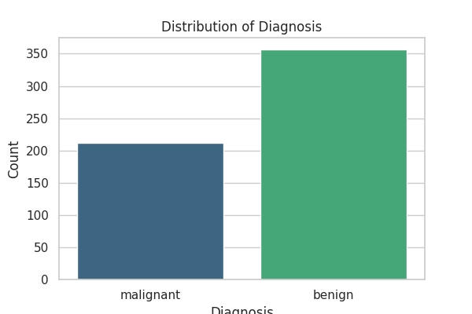
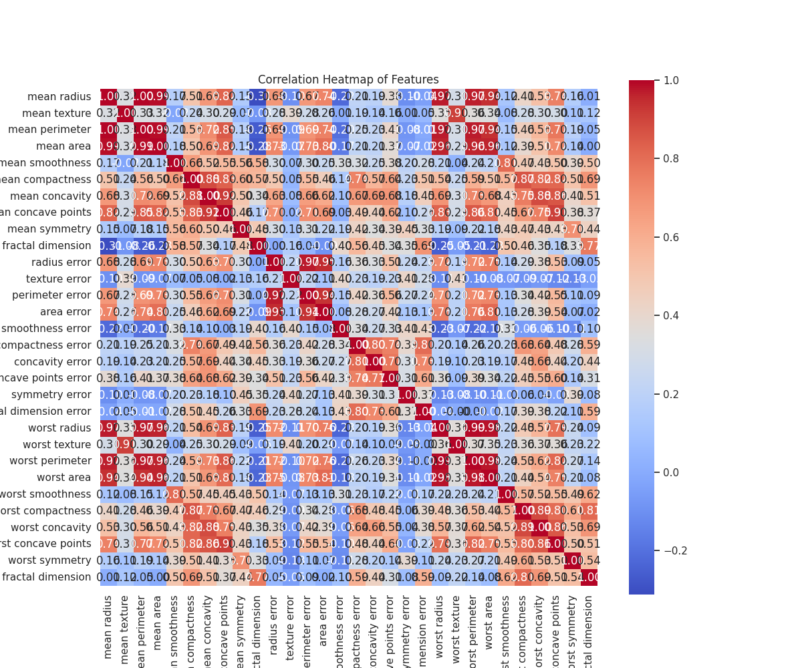
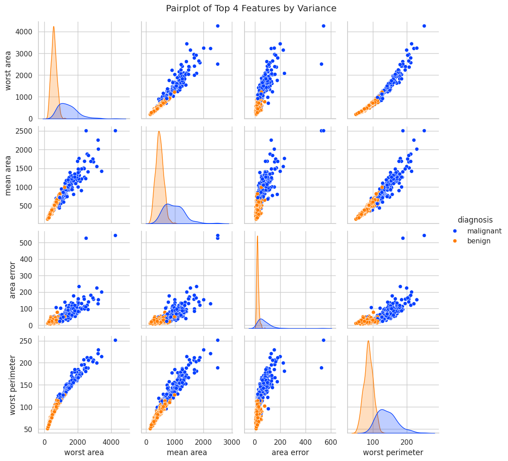
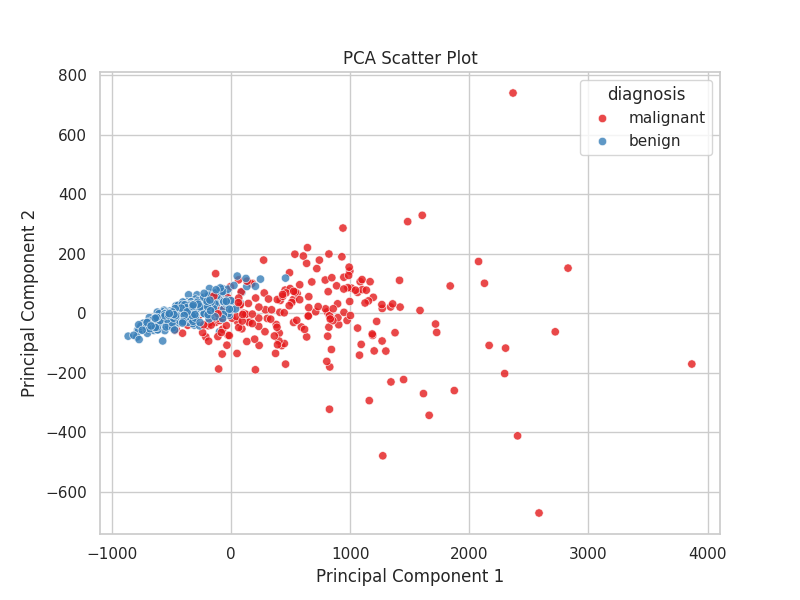
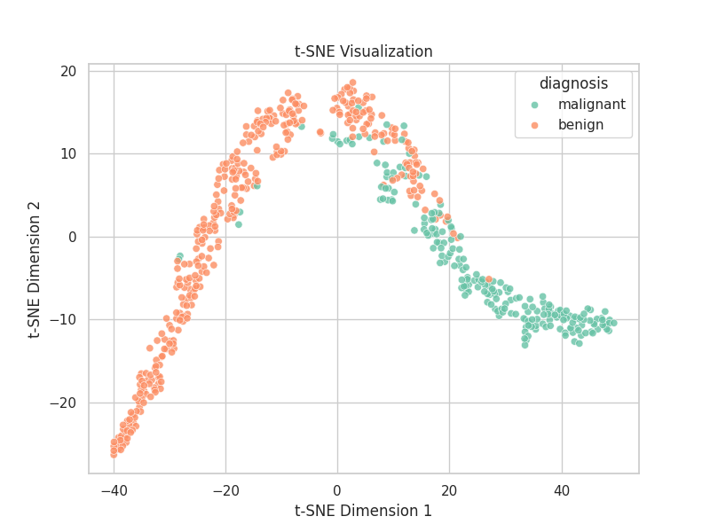
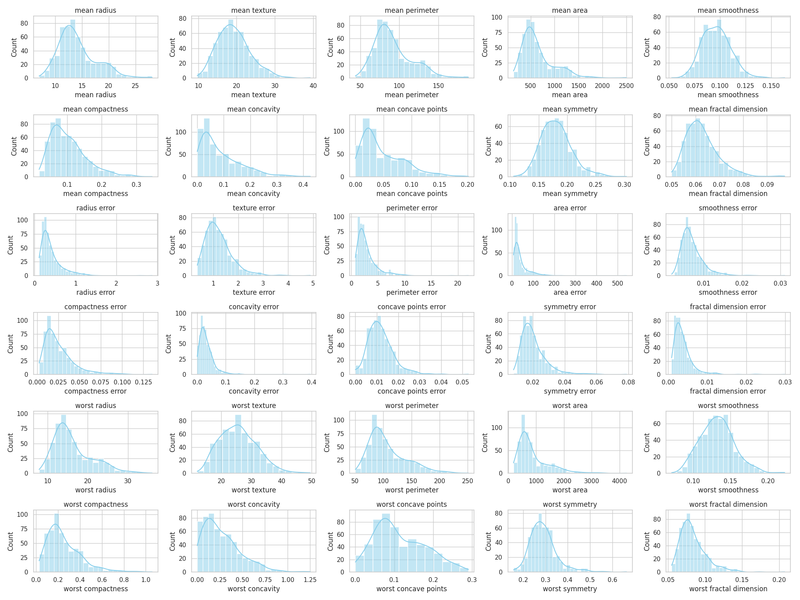
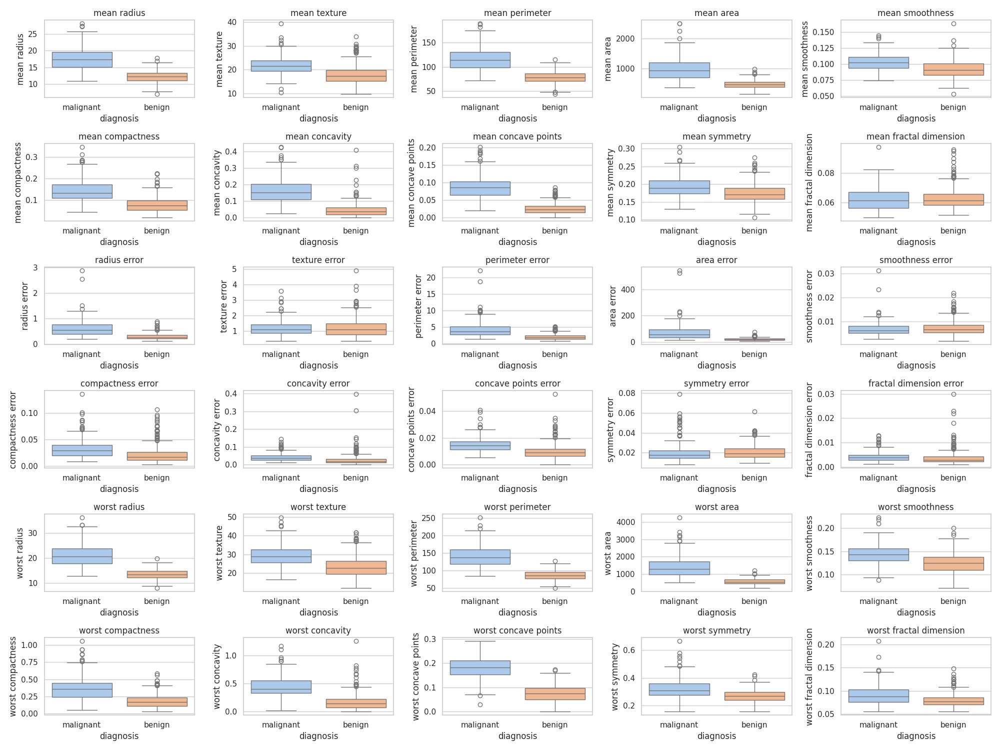

# Breast Cancer Data Visualization - Wisconsin

This repository provides a comprehensive suite of visualizations to explore the [Breast Cancer Wisconsin Diagnostic Dataset](https://archive.ics.uci.edu/ml/datasets/Breast+Cancer+Wisconsin+(Diagnostic)) as well as the version available via scikit-learn’s `load_breast_cancer()` function. The dataset contains 569 samples with 30 real-valued features derived from digitized images of fine needle aspirates (FNAs) of breast masses, along with a binary target indicating whether a tumor is **malignant** or **benign**. This part is to explore patterns, feature relationships, and class separability using different data visualization techniques.

## 📌 Dataset Overview
The dataset contains **569** samples with **30 real-valued features** derived from digitized images of fine needle aspirates (**FNAs**) of breast masses. The goal is to classify tumors as:
- **🔵 Malignant (Cancerous) - Label: `0`**
- **🔴 Benign (Non-cancerous) - Label: `1`**

---

## 📊 Visualization Results

All visualizations are stored in the `results/` folder. Below is an explanation of each visualization along with embedded images.

### 1️⃣ Diagnosis Distribution
- **What it shows:** The count of **benign** and **malignant** cases.
- **Observation:** The dataset has more benign cases than malignant cases.

📌 **Result:**  


---

### 2️⃣ Correlation Heatmap
- **What it shows:** The relationships between different features.
- **Observation:** Some features, like **mean radius, mean perimeter, and mean area**, are **highly correlated** with each other, indicating possible redundancy.

📌 **Result:**  


---

### 3️⃣ Pair Plot of Top 4 Features
- **What it shows:** The pairwise relationships of **four features with the highest variance**.
- **Observation:** Malignant and benign classes form **distinct clusters**, indicating that some features are effective in classification.

📌 **Result:**  


---

### 4️⃣ PCA Scatter Plot (Principal Component Analysis)
- **What it shows:** A **2D projection** of the dataset using **PCA**.
- **Observation:** PCA effectively separates the two classes, but with **some overlap**, suggesting the need for non-linear decision boundaries.

📌 **Result:**  


---

### 5️⃣ t-SNE Visualization
- **What it shows:** A **non-linear transformation** to visualize data in **2D space**.
- **Observation:** t-SNE provides **better separation** between benign and malignant cases compared to PCA.

📌 **Result:**  


---

### 6️⃣ Feature Histograms
- **What it shows:** The **distribution of each feature**.
- **Observation:** Some features are **normally distributed**, while others show skewness, indicating the need for **feature scaling**.

📌 **Result:**  


---

### 7️⃣ Boxplots of Features by Diagnosis
- **What it shows:** The **spread of feature values** for **malignant vs. benign** tumors.
- **Observation:** Many features (e.g., mean area, mean radius) **have significantly different distributions** between benign and malignant cases.

📌 **Result:**  


---

## 🚀 How to Run the Project

### 🛠 Prerequisites
Make sure you have **Python 3.x** installed, along with the following libraries:

```bash
pip install numpy pandas matplotlib seaborn scikit-learn
```

### 💻 Running the Visualization Script
Clone the repository and run the visualization script:

```bash
git clone https://github.com/yourusername/gnn-breast-cancer-visualizations.git
cd gnn-breast-cancer-visualizations
python visualize_breast_cancer_save.py
```

This will generate the visualization images in the **`results/`** folder.

---

## 📁 Project Structure
```
├── README.md
├── requirements.txt
├── visualize_breast_cancer_save.py
└── results
    ├── diagnosis_distribution.png
    ├── correlation_heatmap.png
    ├── pair_plot.png
    ├── pca_scatter.png
    ├── tsne_plot.png
    ├── feature_histograms.png
    └── feature_boxplots.png
```

---

## 📢 Key Takeaways
✅ **PCA and t-SNE** effectively reduce dimensionality while maintaining class separability.  
✅ **Some features are highly correlated**, indicating the potential for feature selection.  
✅ **Benign and malignant tumors** exhibit significantly different distributions in several features.  

This visualization provides **valuable insights** that can be used to improve **breast cancer classification models**.

---

## 📢 Next
✅ **Graph Neural Network**  
✅ **Transformers** 

---

## 📜 License
This project is licensed under the **MIT License**.

---


